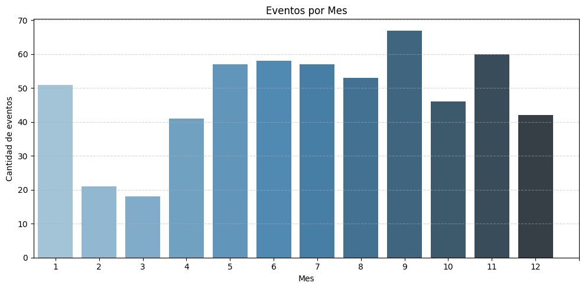
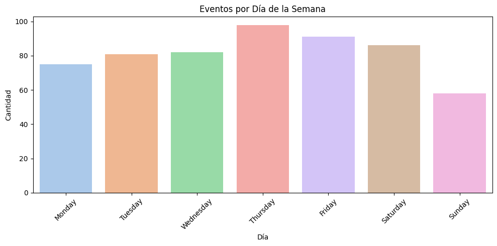
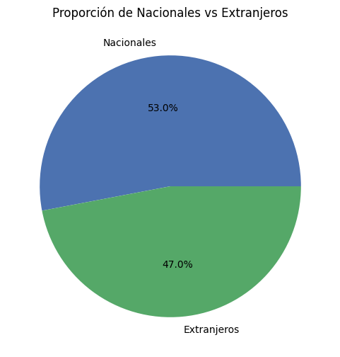
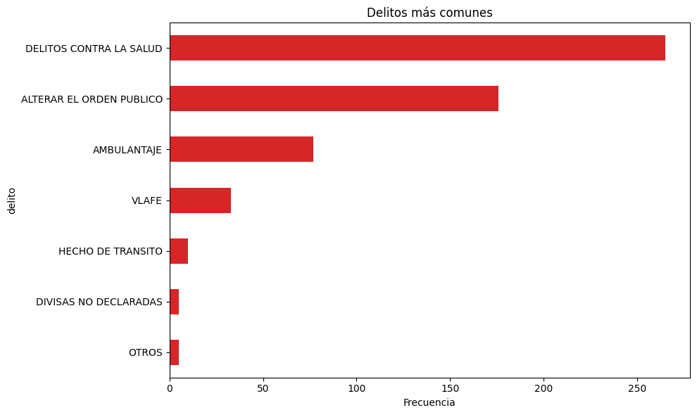
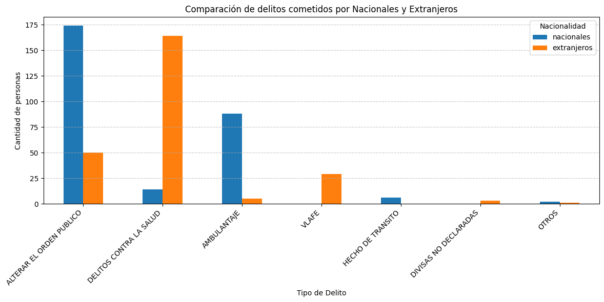
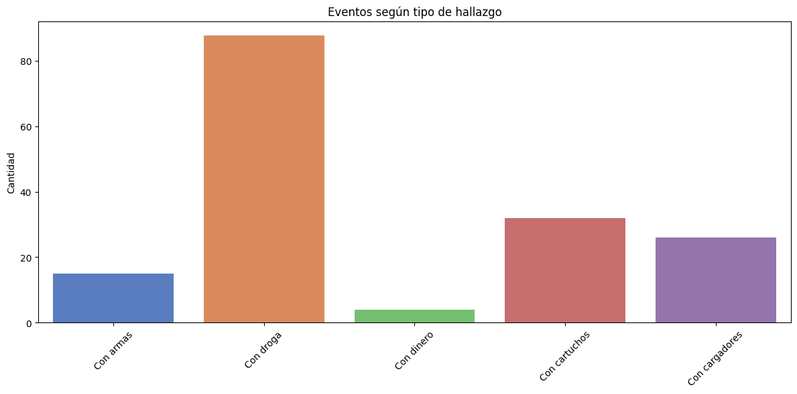

# ✈️ Puestas a Disposición en el Aeropuerto de Cancún (2023)

## 📋 Resumen Ejecutivo

Durante el año 2023, se registraron diversas puestas a disposición en el Aeropuerto Internacional de Cancún. Este informe presenta un análisis exploratorio visual del conjunto de datos correspondiente, enfocado en detectar patrones, comparar la incidencia de delitos por nacionalidad y visualizar las tendencias más relevantes.

---

## 🔍 Preguntas de Investigación

- ¿En qué meses se registraron más puestas a disposición?
- ¿Cuáles fueron los delitos más comunes?
- ¿Cuál es la proporción entre nacionales y extranjeros involucrados?
- ¿Hay una relación entre el tipo de delito y la nacionalidad?
- ¿Qué patrones aparecen en los hallazgos de armas, droga o dinero?
- ¿En qué días de la semana se registran más eventos?

---

## 📊 Análisis Exploratorio Visual

### 1. Eventos por mes

> La mayor cantidad de delitos ocurrió en el mes de **septiembre**, seguido de **noviembre**. Esto podría relacionarse con temporadas turísticas y de festivales de música electrónica.

---

### 2. Eventos por día de la semana

> No hay mucha diferencia sobre los delitos cometidos en la semana, sin embargo, los **jueves** seguido de **viernes**, son los días con un poco más de actividad. Esto puede estar relacionado con los picos de operación del aeropuerto, como los días de mayor llegada de vuelos internacionales y nacionales.

---

### 3. Nacionales vs Extranjeros

> Aproximadamente el **53%** de las personas puestas a disposición fueron **nacionales**, mientras que el **47%** fueron **extranjeros**.

---

### 4. Tipos de delitos más comunes en el aeropuerto

> Los delitos más frecuentes fueron:
> - Delitos contra la salud  
> - Alterar el orden público  
> - Ambulantaje

---

### 5. Comparación por nacionalidad

> Los **nacionales** estuvieron más implicados en faltas administrativas como **alterar el orden público**, mientras que los **extranjeros** predominan en **delitos contra la salud**.

---

### 6. Hallazgos de armas, cartuchos, cargadores, droga y dinero

> Se detectaron:
> - 15 casos con armas  
> - 510 cartuchos  
> - 39 cargadores  
> - 87.67 kg de droga asegurados  
> - 4 casos de personas con más de 20,000 dólares  

---

## 🧾 Conclusiones

- La actividad delictiva presenta patrones claros durante el año.
- Hay diferencias significativas entre el tipo de delitos cometidos por nacionales y extranjeros.
- La presencia de armas, drogas y dinero requiere atención especial para fortalecer la seguridad aeroportuaria.
- Ciertos días de la semana presentan mayor incidencia, lo que podría apoyar la planeación de operativos.
- Existe la posibilidad de que **los eventos musicales cercanos a Cancún influyan en un aumento de los delitos relacionados con droga**, lo cual sugiere una correlación que merece ser investigada más a fondo.

---

📁 **Datos:** `data/data_limpio.csv`  
📂 **Gráficos:** Carpeta `img_proyecto/`  
📜 **Autor:** go1ter
🔗 **Portafolio:** eduardovelazquezsosa.com.mx 
